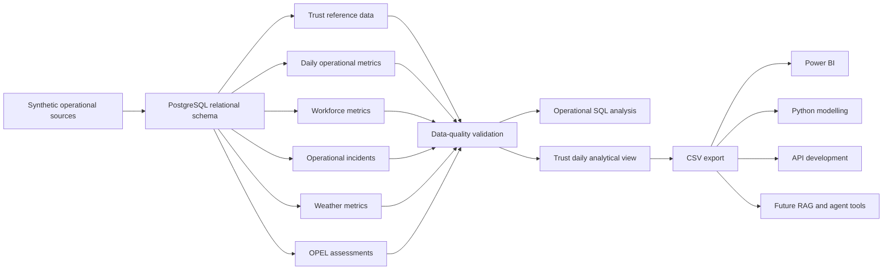
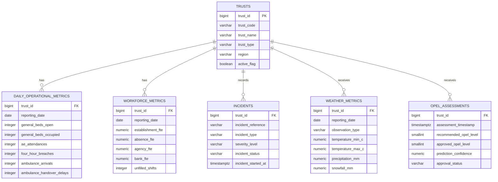

# NHS Operational Data Platform

## Project Overview

The NHS Operational Data Platform is a PostgreSQL-based portfolio project demonstrating how operational healthcare data can be structured, validated, analysed and prepared for downstream reporting and AI workflows.

The platform combines fictional Trust-level data covering:

- bed capacity and occupancy;
- A&E demand and four-hour breaches;
- ambulance handover pressure;
- admissions, discharges and discharge readiness;
- workforce capacity and absence;
- operational incidents;
- weather conditions;
- OPEL recommendations and human-approved decisions.

The project was developed as the data-engineering foundation for future Power BI dashboards, Python analysis, API development, feature engineering and healthcare AI experimentation.

All organisations and values are synthetic.

---

## NHS Operational Problem

Operational teams often need to understand pressure across several connected areas rather than reviewing one metric in isolation.

For example, increasing bed occupancy may coincide with:

- higher A&E demand;
- ambulance handover delays;
- patients waiting for discharge;
- workforce absence;
- unfilled shifts;
- operational incidents;
- weather disruption;
- higher OPEL escalation levels.

When these datasets are held separately, analysts may face:

- inconsistent definitions;
- duplicated records;
- missing reporting dates;
- unreliable joins;
- unclear data lineage;
- manual reconciliation;
- weak auditability;
- difficulty producing a single management-ready view.

This project demonstrates how a relational data platform can provide a controlled analytical foundation.

---

## Intended Users

The fictional platform is designed around the needs of:

- NHS Trust information analysts;
- ICB operational analysts;
- performance and planning teams;
- winter-pressure teams;
- workforce planners;
- data engineers;
- BI developers;
- data scientists;
- healthcare AI engineers.

---

## Project Objectives

The project aims to demonstrate the ability to:

1. design a relational PostgreSQL schema;
2. apply primary keys, foreign keys, unique constraints and validation rules;
3. generate reproducible synthetic operational data;
4. preserve source and batch lineage;
5. identify poor-quality records using SQL;
6. answer operational-management questions;
7. produce one analytical row per Trust per reporting date;
8. export a controlled dataset for downstream systems;
9. document governance, limitations and human accountability;
10. communicate findings using Band 7-style analytical language.

---

## Architecture



The architecture separates source data, relational storage, validation, analysis, reporting outputs and future AI-enabled services.

---

## Database Schema

The platform uses the PostgreSQL schema:

`operational`

It contains six core tables:

| Table | Purpose | Grain |
|---|---|---|
| `trusts` | Stores fictional healthcare organisation reference data | One row per Trust |
| `daily_operational_metrics` | Stores daily capacity, demand, ambulance and patient-flow measures | One row per Trust per reporting date |
| `workforce_metrics` | Stores daily workforce capacity and pressure measures | One row per Trust per reporting date |
| `incidents` | Stores fictional operational disruptions | One row per incident |
| `weather_metrics` | Stores observed or forecast weather measures | One row per Trust, reporting date and observation type |
| `opel_assessments` | Stores recommended and approved OPEL assessments | One row per assessment event |

The reporting layer also includes:

`operational.vw_trust_daily_analytical`

This view produces one analytical row per Trust and reporting date.

---

## Table Relationships

Each operational table links back to the fictional Trust reference table through `trust_id`.



The physical entity-relationship design is documented in:

`docs/database_erd.md`

The analytical view is not a physical source table. It is a derived reporting layer built from validated operational records.

---

## Relational Design Controls

The database applies controls at schema level rather than relying only on downstream reporting checks.

These include:

- generated identity primary keys;
- foreign keys linking operational records to a valid Trust;
- restricted update and delete behaviour;
- unique fictional Trust codes;
- unique daily operational records by Trust and reporting date;
- unique workforce records by Trust and reporting date;
- controlled incident severity and status values;
- non-negative operational and workforce measures;
- occupied beds prevented from exceeding available beds;
- A&E breaches prevented from exceeding attendances;
- ambulance delays prevented from exceeding arrivals;
- OPEL levels restricted to 1–4;
- prediction confidence restricted to 0–1;
- required review information for approved OPEL assessments;
- source-system, source-record and load-batch lineage fields.

These controls reduce the risk of invalid or duplicate records entering the analytical layer.

---

## Synthetic Dataset

The platform uses a deterministic synthetic dataset covering:

`1 January 2026 to 30 January 2026`

The dataset contains:

| Dataset | Records |
|---|---:|
| Fictional Trusts | 3 |
| Daily operational records | 90 |
| Workforce records | 90 |
| Operational incidents | 24 |
| Observed weather records | 90 |
| OPEL assessments | 90 |
| **Total records** | **387** |

The data was generated using:

- fixed fictional Trust codes;
- a fixed reporting period;
- deterministic PostgreSQL logic;
- repeatable source-record identifiers;
- a fixed load-batch UUID;
- documented pressure patterns;
- transaction-based loading;
- pre-commit record-count validation.

The dataset is reproducible and can be reloaded consistently into a clean test database.

The synthetic-data methodology and limitations are documented in:

`docs/synthetic_data_provenance.md`

The successful load results are documented in:

`docs/synthetic_data_load_results.md`

No real patient, staff or NHS Trust performance data is included.

---

## Repository Structure

```text
NHS_Operational_Data_Platform/
│
├── README.md
│
├── sql/
│   ├── schema/
│   │   ├── 01_create_database.sql
│   │   └── 02_create_tables.sql
│   │
│   ├── seed/
│   │   └── 03_insert_sample_data.sql
│   │
│   ├── quality/
│   │   └── 04_validation_queries.sql
│   │
│   ├── analysis/
│   │   └── 05_operational_analysis.sql
│   │
│   └── views/
│       └── 06_create_trust_daily_analytical_view.sql
│
├── tests/
│   └── schema/
│       ├── test_core_schema.sql
│       └── test_constraint_failures.sql
│
├── outputs/
│   └── query_results.csv
│
└── docs/
    ├── architecture.md
    ├── database_erd.md
    ├── table_relationships.md
    ├── constraint_test_results.md
    ├── synthetic_data_provenance.md
    ├── synthetic_data_load_results.md
    ├── data_quality_test_results.md
    ├── day5_operational_analysis_results.md
    ├── day5_band7_findings.md
    ├── data_dictionary.md
    └── governance_notes.md
```

The numbered SQL files make the intended execution order clear and reproducible.

---

## Technology Stack

| Technology | Purpose |
|---|---|
| PostgreSQL | Relational database design, constraints, views and analytical SQL |
| pgAdmin 4 | Database administration, script execution and CSV export |
| GitHub | Version control, documentation and portfolio presentation |
| Mermaid | Architecture and entity-relationship diagrams |
| CSV | Portable analytical output for downstream tools |
| Power BI | Planned operational dashboard and management reporting layer |
| Python | Planned exploratory analysis, feature engineering and modelling |
| FastAPI | Planned API layer for controlled data access |
| Docker | Planned containerisation and reproducible deployment |
| Azure | Planned cloud, AI and deployment environment |

---

## Setup Instructions

### Prerequisites

Install:

- PostgreSQL;
- pgAdmin 4;
- Git, or use GitHub through a web browser.

No real NHS data is required.

### Create the Database

Run:

`sql/schema/01_create_database.sql`

Then connect to the newly created database before running the remaining scripts.

The project used:

- `nhs_operations` for development;
- `nhs_operations_test` for clean schema, constraint and data-load testing.

### Script Execution Order

Run the SQL files in this order:

1. `sql/schema/01_create_database.sql`
2. `sql/schema/02_create_tables.sql`
3. `sql/seed/03_insert_sample_data.sql`
4. `sql/quality/04_validation_queries.sql`
5. `sql/analysis/05_operational_analysis.sql`
6. `sql/views/06_create_trust_daily_analytical_view.sql`

After creating the analytical view, run:

```sql
SELECT *
FROM operational.vw_trust_daily_analytical
ORDER BY
    trust_code,
    reporting_date;
```

Expected output:

- 90 rows;
- 3 fictional Trusts;
- 30 reporting dates;
- one row per Trust and reporting date.

### Verify the Analytical Grain

```sql
SELECT
    COUNT(*) AS total_rows,
    COUNT(DISTINCT trust_id) AS trust_count,
    COUNT(DISTINCT reporting_date) AS reporting_date_count
FROM operational.vw_trust_daily_analytical;
```

Expected result:

| total_rows | trust_count | reporting_date_count |
|---:|---:|---:|
| 90 | 3 | 30 |

### Check for Duplicate Trust-Date Rows

```sql
SELECT
    trust_id,
    reporting_date,
    COUNT(*) AS duplicate_count
FROM operational.vw_trust_daily_analytical
GROUP BY
    trust_id,
    reporting_date
HAVING COUNT(*) > 1;
```

Expected result:

`0 rows`

---

## Reproducible Data Loading

The synthetic dataset is loaded through:

`sql/seed/03_insert_sample_data.sql`

The seed process is designed to be repeatable and auditable.

It uses:

- a fixed reporting period from 1 January to 30 January 2026;
- three fixed fictional Trust codes;
- deterministic SQL rather than random generation;
- repeatable `source_record_id` values;
- a fixed `load_batch_id`;
- transaction control using `BEGIN` and `COMMIT`;
- pre-commit row-count validation;
- batch-specific cleanup before reloading.

The seed script validates the expected counts before committing:

| Table | Expected rows |
|---|---:|
| `trusts` | 3 |
| `daily_operational_metrics` | 90 |
| `workforce_metrics` | 90 |
| `incidents` | 24 |
| `weather_metrics` | 90 |
| `opel_assessments` | 90 |

If the expected counts are not achieved, the transaction raises an exception and prevents an incomplete load from being committed.

This supports:

- reproducibility;
- safer testing;
- easier defect investigation;
- controlled downstream analysis;
- repeatable portfolio demonstrations.

---

## Data-Quality Controls

The validation script is located at:

`sql/quality/04_validation_queries.sql`

It checks the synthetic dataset for:

- expected record counts;
- duplicate daily operational records;
- duplicate workforce records;
- duplicate incident references;
- duplicate source-record identifiers;
- missing required operational values;
- missing workforce values;
- impossible bed values;
- calculated occupancy outside expected ranges;
- A&E breaches exceeding attendances;
- ambulance delays exceeding arrivals;
- invalid admissions or discharge values;
- negative workforce measures;
- substantive FTE exceeding establishment FTE;
- orphan records without a valid Trust;
- inconsistent incident timestamps;
- invalid incident severity or status values;
- invalid weather values;
- incomplete weather-warning details;
- invalid OPEL levels;
- invalid confidence values;
- incomplete approval information;
- review timestamps occurring before assessment;
- missing daily reporting dates;
- missing workforce dates;
- missing observed-weather dates;
- missing OPEL assessment dates;
- duplicate Trust-date rows in the analytical layer.

The consolidated validation summary returned:

| Validation check | Failed records | Result |
|---|---:|---|
| Duplicate daily records | 0 | Passed |
| Missing daily values | 0 | Passed |
| Invalid bed values | 0 | Passed |
| Invalid A&E values | 0 | Passed |
| Orphan records | 0 | Passed |
| Missing reporting dates | 0 | Passed |

Passing these tests confirms structural consistency within the synthetic dataset. It does not prove that the data is suitable for real NHS operational or clinical use.

The detailed results are documented in:

`docs/data_quality_test_results.md`

---

## Example Operational Questions

The operational-analysis script is located at:

`sql/analysis/05_operational_analysis.sql`

It answers the following management questions:

1. Which Trust had the highest average general-bed occupancy?
2. Which Trust-dates had the highest A&E four-hour breach rates?
3. How often did each Trust reach approved OPEL 3 or OPEL 4?
4. Were workforce-pressure indicators higher on OPEL 4 days?
5. Which Trust recorded the most project-defined red-flag incidents?
6. What was the ambulance handover-delay percentage by approved OPEL level?
7. Did lower temperature coincide with greater operational pressure?

The queries use:

- explicit reporting-date filters;
- `NULLIF` to reduce division-by-zero risk;
- controlled aggregation;
- ranking to select one daily OPEL assessment;
- documented synthetic definitions;
- joins designed to preserve the intended analytical grain.

The project-defined red-flag incident rule is:

```sql
severity_level IN ('high', 'critical')
```

This is not an official NHS classification.

The ambulance measure represents the percentage of ambulance arrivals recorded as delayed. It does not represent average delay duration in minutes.

---

## Example Findings

The synthetic analysis produced the following observations.

### Average General-Bed Occupancy

| Trust | Average occupancy |
|---|---:|
| South County Community Trust | 92.45% |
| North Riverside NHS Trust | 92.07% |
| Westborough General Hospital | 91.47% |

All three fictional organisations recorded average occupancy above 91%.

The variation between the organisations was narrow and should not be interpreted as a substantial performance difference.

### Highest A&E Four-Hour Breach Rate

The highest synthetic Trust-day result was:

| Trust | Date | A&E attendances | Four-hour breaches | Breach rate |
|---|---|---:|---:|---:|
| South County Community Trust | 2026-01-27 | 192 | 60 | 31.25% |

Several of the highest breach-rate dates occurred during the later part of January, reflecting the deliberately constructed pressure pattern in the synthetic data.

### OPEL 3 or 4 Frequency

| Trust | OPEL 3 or 4 days | OPEL 4 days | Percentage of assessed days |
|---|---:|---:|---:|
| North Riverside NHS Trust | 17 | 0 | 56.67% |
| Westborough General Hospital | 15 | 7 | 50.00% |
| South County Community Trust | 7 | 0 | 23.33% |

North Riverside recorded the highest proportion of days at OPEL 3 or above.

Westborough was the only fictional organisation to reach OPEL 4.

### Workforce Pressure on OPEL 4 Days

| Measure | Non-OPEL 4 days | OPEL 4 days |
|---|---:|---:|
| Average workforce absence | 6.21% | 8.68% |
| Average agency FTE | 33.28 | 82.60 |
| Average bank FTE | 16.25 | 29.50 |
| Average unfilled shifts | 12.41 | 29.29 |

All four workforce-pressure measures were higher on OPEL 4 days within the synthetic dataset.

This shows an association within the simulated data. It does not establish that workforce pressure caused OPEL escalation.

### Synthetic Red-Flag Incidents

All three Trusts recorded four incidents classified as high or critical.

Westborough General Hospital recorded:

- the highest total number of incidents;
- the highest number of unresolved incidents;
- the same number of project-defined red-flag incidents as the other two Trusts.

### Ambulance Handover Pressure by OPEL Level

| Approved OPEL level | Weighted handover-delay percentage |
|---:|---:|
| 1 | 12.46% |
| 2 | 32.70% |
| 3 | 42.58% |
| 4 | 38.44% |

The highest weighted percentage occurred on OPEL 3 days rather than OPEL 4 days.

This demonstrates why analysts should examine individual indicators rather than assuming that every pressure measure rises uniformly with escalation level.

### Temperature and Operational Pressure

| Minimum-temperature band | Average occupancy | A&E breach rate | Ambulance delay percentage | Average approved OPEL |
|---|---:|---:|---:|---:|
| Below 0°C | 88.60% | 13.33% | 18.72% | 1.76 |
| 0°C to below 3°C | 91.77% | 18.05% | 34.75% | 2.15 |
| 3°C and above | 94.77% | 24.49% | 62.22% | 2.83 |

The synthetic dataset showed the greatest average pressure in the `3°C and above` temperature band.

The result does not support a simple conclusion that colder days coincided with greater operational pressure.

The full findings, limitations and recommended next steps are documented in:

`docs/day5_band7_findings.md`

All findings are based on deliberately constructed synthetic data and do not establish causation.

---

## Joined Analytical Dataset

The reporting view is created by:

`sql/views/06_create_trust_daily_analytical_view.sql`

The view is named:

`operational.vw_trust_daily_analytical`

Its intended grain is:

`One row per Trust per reporting date`

For the current synthetic dataset, the view returns:

| Measure | Result |
|---|---:|
| Total rows | 90 |
| Fictional Trusts | 3 |
| Reporting dates | 30 |
| Duplicate Trust-date rows | 0 |

The view combines:

- Trust reference data;
- daily operational metrics;
- aggregated workforce metrics;
- one observed weather record per Trust-date;
- one selected OPEL assessment per Trust-date.

It calculates:

- general-bed occupancy percentage;
- critical-care occupancy percentage;
- A&E four-hour breach percentage;
- ambulance handover-delay percentage;
- workforce absence percentage;
- net admissions;
- minimum-temperature band;
- operational-pressure status;
- human OPEL override indicator.

The analytical grain is protected by:

- aggregating workforce data by Trust and reporting date;
- ranking observed weather records and selecting one daily row;
- ranking OPEL assessments and selecting one daily row;
- joining on both `trust_id` and reporting date;
- using `NULLIF` in percentage calculations;
- testing for duplicate Trust-date combinations.

The view is designed as a controlled reporting layer rather than a replacement for the underlying source tables.

---

## Exported Output

The analytical view was exported as:

`outputs/query_results.csv`

The CSV contains 90 synthetic Trust-day records.

It includes fields covering:

- Trust identity;
- reporting date;
- bed capacity and occupancy;
- A&E activity and breaches;
- ambulance activity;
- admissions, discharges and discharge readiness;
- workforce establishment, absence and temporary staffing;
- weather conditions and warnings;
- recommended and approved OPEL levels;
- calculated pressure measures;
- decision-review information;
- source and load lineage.

The export is intended to support:

- Power BI dashboard development;
- Python exploratory analysis;
- feature engineering;
- API response testing;
- pipeline prototyping;
- future RAG and agent demonstrations.

The CSV should be treated as a versioned analytical output.

In a future production system, exports would require controlled storage, access restrictions, refresh dates and retention rules.

The file contains no real patient, staff or NHS Trust performance data.

---

## Auditability

Auditability is built into the schema through fields that preserve data origin, processing history and decision context.

Key lineage and audit fields include:

- `source_system`
- `source_record_id`
- `load_batch_id`
- `data_quality_status`
- `record_created_at`
- `record_updated_at`
- `assessment_timestamp`
- `rule_version`
- `assessed_by_role`
- `reviewed_by_role`
- `reviewed_at`

These fields support questions such as:

- Where did this record come from?
- Which load batch created it?
- When was it created or updated?
- Which rules version produced the recommendation?
- Was the recommendation reviewed?
- Which role completed the review?
- When was the final decision approved?

The fixed synthetic load-batch identifier also supports repeatable testing and controlled reloads.

In a production system, auditability would need to extend beyond the database to include:

- source extraction logs;
- transformation logs;
- failed-record handling;
- user access logs;
- export history;
- model-version history;
- API request logging;
- change approvals;
- deployment history.

---

## Human Accountability

The OPEL design separates:

- `recommended_opel_level`
- `approved_opel_level`

This distinction preserves both the rules-based recommendation and the final human-reviewed decision.

The platform also stores:

- the assessment method;
- assessment rationale;
- key pressure factors;
- prediction confidence;
- assessed-by role;
- reviewed-by role;
- review timestamp;
- rule version.

This allows the analytical layer to identify when a human reviewer accepted or overrode a recommendation.

The derived field:

`human_override_indicator`

shows whether the approved OPEL level differs from the recommended level.

This design supports professional judgement rather than replacing it.

Human reviewers would remain responsible for:

- considering context not represented in the data;
- challenging unexpected recommendations;
- confirming or overriding the proposed level;
- documenting material overrides;
- escalating safety concerns;
- ensuring that operational decisions remain proportionate.

Synthetic confidence scores are illustrative and must not be treated as validated probabilities.

---

## Governance

The project includes a dedicated governance document:

`docs/governance_notes.md`

It covers:

- intended use;
- prohibited use;
- synthetic-data disclaimer;
- data minimisation;
- access control;
- data lineage;
- data-quality assurance;
- human accountability;
- explainability;
- retention considerations;
- export risk;
- future DPIA requirements;
- future Information Governance review;
- future clinical-safety requirements;
- future model-validation requirements.

The current permitted uses are limited to:

- learning;
- technical testing;
- portfolio demonstration;
- reproducibility exercises.

The platform must not be used to:

- make real operational decisions;
- make clinical decisions;
- assess the performance of real NHS organisations;
- identify patients or staff;
- allocate resources;
- validate real OPEL decisions;
- present synthetic findings as real evidence.

No database passwords, secrets, tokens or connection strings should be committed to the repository.

---

## Limitations

This project is a portfolio and learning implementation rather than a production NHS data platform.

Its main limitations are:

- all organisations, incidents and performance values are fictional;
- the dataset covers only 30 days;
- only three fictional Trusts are represented;
- synthetic patterns were deliberately created for analytical demonstration;
- the data does not reflect real NHS seasonal variation;
- the OPEL recommendation logic has not been clinically or operationally validated;
- confidence values are illustrative rather than calibrated probabilities;
- the analytical view uses simplified business rules;
- no real-time ingestion pipeline has been implemented;
- no automated orchestration or scheduling is included;
- no authentication or role-based access control has been implemented;
- no production backup, recovery or disaster-recovery process exists;
- no formal data-protection impact assessment has been completed;
- no clinical-safety case has been completed;
- no model monitoring or drift detection has been implemented;
- the CSV export is static rather than automatically refreshed;
- the project has not been performance-tested at NHS-scale data volumes.

The analytical findings describe only the synthetic dataset and must not be generalised to real NHS organisations.

---

## Next Steps

Planned development stages include the following.

### Reporting and Visualisation

- connect the analytical view to Power BI;
- create executive operational-pressure dashboards;
- add Trust, date and OPEL filters;
- build occupancy, A&E, ambulance and workforce trend pages;
- add data-quality and lineage reporting;
- create management-ready KPI definitions.

### Python Analytics

- connect Python securely to PostgreSQL;
- perform exploratory data analysis;
- test feature-engineering pipelines;
- create reusable data-validation functions;
- compare SQL and Python calculation outputs;
- produce reproducible analytical notebooks.

### Predictive Modelling

- develop an explainable OPEL-risk model;
- use time-aware training and test splits;
- prevent target leakage;
- compare baseline and advanced models;
- measure calibration and classification performance;
- document model limitations and appropriate use;
- preserve human review and override controls.

### API and Deployment

- expose approved analytical outputs through FastAPI;
- validate request and response schemas;
- containerise the application using Docker;
- add automated tests and CI/CD;
- implement environment-based configuration;
- deploy a controlled demonstration environment;
- add logging, monitoring and error handling.

### Cloud and AI Services

- evaluate Azure database and deployment services;
- create a healthcare document-intelligence layer;
- develop retrieval-augmented generation using approved documentation;
- build governed agent workflows;
- restrict AI-generated recommendations to advisory use;
- record prompts, retrieved evidence, outputs and human decisions.

### Production Readiness

Before any real operational use, the platform would require:

- formal stakeholder requirements;
- Information Governance approval;
- a data-protection impact assessment;
- role-based access control;
- NHS identity and access integration;
- secure secrets management;
- data-sharing agreements;
- data-retention policies;
- clinical-safety assessment where applicable;
- DCB0129 and DCB0160 consideration;
- penetration and security testing;
- model validation and monitoring;
- incident-management procedures;
- documented human accountability.

---

## Portfolio Value

This project demonstrates practical capability across:

- relational data modelling;
- PostgreSQL schema development;
- primary and foreign-key design;
- data-integrity constraints;
- deterministic synthetic-data generation;
- transaction-controlled loading;
- source and batch lineage;
- SQL data-quality testing;
- operational healthcare analysis;
- analytical-view development;
- prevention of duplicate reporting rows;
- reproducible CSV export;
- governance documentation;
- human-in-the-loop decision design;
- communication of analytical findings;
- GitHub-based technical documentation.

The project provides evidence that the author can move beyond isolated SQL queries and build a documented analytical data product with:

- a defined operational problem;
- controlled data structures;
- quality assurance;
- reproducible processing;
- management-focused analysis;
- governance controls;
- future deployment pathways.

It is particularly relevant to roles such as:

- NHS Information Analyst;
- Senior Information Analyst;
- BI Developer;
- Healthcare Data Engineer;
- Operational Intelligence Analyst;
- Population Health Analyst;
- Healthcare Data Scientist;
- Health and Care AI Engineer.

---

## Disclaimer

This is a synthetic operational analytics platform for learning and portfolio demonstration.

It is not a production NHS system and should not be used to make operational or clinical decisions.

No real patient, staff or NHS Trust performance data is included.

