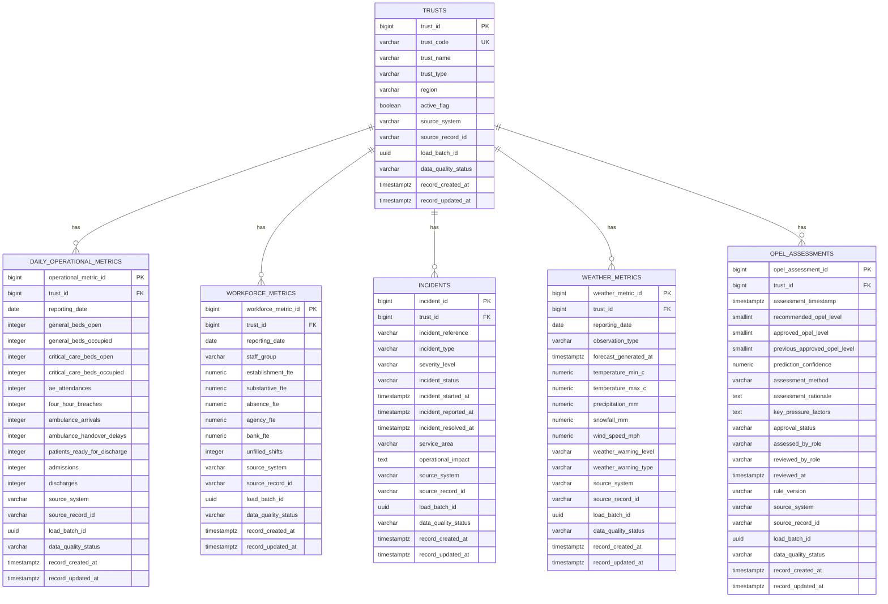

# NHS Operational Data Platform — Entity Relationship Diagram

## Relationship Notes

- `operational.trusts` is the parent reference table.
- Each operational table contains `trust_id` as a foreign key.
- One Trust can have many operational, workforce, incident, weather, and OPEL records.
- The direct Trust-to-weather relationship is a temporary prototype simplification.
- A future design should link weather through sites or geographical areas.
- OPEL recommendations and approved operational decisions are stored separately to preserve governance and auditability.
