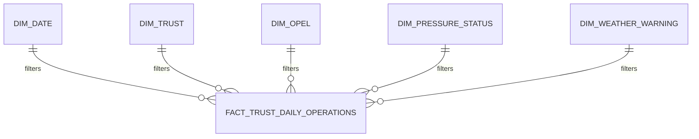

# NHS Operational Intelligence Dashboard — Power BI Data Model Specification

## Document Purpose

This document defines the semantic-model design for the Power BI reporting layer of the NHS Operational Intelligence Platform.

It specifies:

- reporting grain;
- fact and dimension tables;
- relationship design;
- filter direction;
- default summarisation rules;
- measure organisation;
- field visibility;
- source-enrichment dependencies;
- model validation requirements.

All organisations and values are synthetic.

The model is designed for learning, technical testing and portfolio demonstration. It must not be interpreted as a production NHS data model or used for real operational or clinical decisions.

---

## Model Objective

The objective of the Power BI semantic model is to provide a controlled analytical layer between the validated PostgreSQL data source and the dashboard visuals.

The model should:

1. preserve the correct reporting grain;
2. prevent invalid aggregations;
3. support consistent filtering;
4. separate descriptive dimensions from operational measures;
5. support reproducible KPI calculations;
6. remain reconcilable against PostgreSQL;
7. make source limitations visible;
8. preserve human accountability around OPEL decisions;
9. support future source enrichment without redesigning the entire report;
10. provide a clear structure that can be explained in technical and NHS analytics interviews.

---

## Reporting Grain

The primary reporting grain is:

**One row per fictional Trust per reporting date.**

This will be referred to as the:

**Trust-date grain**

A valid row represents one fictional NHS Trust on one reporting date with associated:

- capacity measures;
- patient-flow measures;
- A&E activity;
- ambulance measures;
- workforce measures;
- weather information;
- approved OPEL information;
- operational-pressure status;
- human-override information.

The semantic model must preserve this grain unless a separate fact table is explicitly introduced for a different business process.

---

## Current Analytical Source

The current Power BI analytical source is based on a Trust-date extract derived from the PostgreSQL analytical layer.

The current dataset contains:

- three fictional Trusts;
- thirty reporting dates;
- ninety Trust-date records;
- operational measures;
- workforce measures;
- weather measures;
- approved OPEL information.

Some KPI calculations require source enrichment before they can be implemented as final Power BI measures.

Examples include:

- weighted A&E four-hour breach rate;
- ambulance handover delay rate;
- recommended-versus-approved OPEL comparison;
- incident KPIs;
- weighted bed-occupancy calculations;
- weighted workforce-absence calculations.

These limitations must remain visible in the semantic-model documentation.

---

## Recommended Model Strategy

The Power BI model will use a star-schema approach.

The central fact table will contain Trust-date operational observations.

Dimension tables will contain descriptive attributes used for filtering, grouping and navigation.

Planned structure:

```text
DimDate
DimTrust
DimOPEL
DimPressureStatus
DimWeatherWarning
        │
        ▼
FactTrustDailyOperations
        │
        ▼
_Measures
```

The `_Measures` table will be a logical measure container and will not participate in data relationships.

---

## Model Design Principles

The semantic model will follow these principles:

1. The fact table will preserve one row per Trust per reporting date.
2. Dimension tables will contain descriptive attributes rather than repeated operational measurements.
3. Relationships will normally use one-to-many cardinality from dimensions to the fact table.
4. Filter direction will be single-direction by default.
5. Bidirectional filtering will not be introduced without a documented analytical need.
6. Many-to-many relationships will be avoided unless explicitly justified.
7. Date filtering will use a dedicated date dimension.
8. Report slicers should use dimension fields rather than equivalent fact-table fields wherever possible.
9. Percentage fields will not use automatic Sum aggregation.
10. OPEL levels will be treated as ordered categories rather than additive numbers.
11. Agency and bank FTE values will not default to Sum across dates.
12. Patients-ready-for-discharge values will only be summed when explicitly labelled as patient-days.
13. Weighted percentages will use raw numerators and denominators wherever available.
14. Blocked weighted KPIs will remain unavailable until the required source fields exist.
15. Recommended OPEL and approved OPEL will remain separate.
16. Human-override information will remain visible for governance purposes.
17. Technical keys, sort columns and lineage fields may be hidden from normal report users while remaining available for testing.
18. Every major Power BI measure must remain reconcilable against PostgreSQL.
19. Synthetic associations will not be presented as causal conclusions.
20. No official NHS threshold will be invented inside the semantic model.

---

## Semantic Model Layers

The Power BI solution will conceptually contain four layers.

### Layer 1 — Source Layer

Source:

- PostgreSQL operational schema;
- validated analytical view or export;
- synthetic data only.

Purpose:

- provide governed source records;
- preserve traceability;
- support SQL reconciliation.

### Layer 2 — Transformation Layer

Power Query will be used for:

- data-type enforcement;
- column renaming where required;
- controlled null handling;
- dimension creation;
- removal of unnecessary duplicate descriptive fields;
- source-quality checks.

Business KPI calculations should not be hidden unnecessarily inside Power Query when they are better expressed as transparent DAX measures.

### Layer 3 — Semantic Layer

The semantic layer will contain:

- fact table;
- dimensions;
- relationships;
- calculated measures;
- sort logic;
- display folders;
- field-visibility settings.

### Layer 4 — Presentation Layer

The presentation layer will contain the nine report pages defined in:

`docs/dashboard_wireframes.md`

Visuals should consume controlled measures and dimension fields rather than relying on implicit calculations.

---

## Why a Star Schema Is Used

A star schema is preferred because it:

- makes filter behaviour easier to understand;
- reduces ambiguous relationship paths;
- separates descriptive attributes from measures;
- simplifies DAX;
- improves report maintainability;
- supports reusable dimensions;
- makes the model easier to explain to analysts and reviewers;
- provides a stronger foundation for future scale.

A single wide flat table may be useful as a source extract, but it will not be treated as the final logical reporting model.

---

# Fact Table Specification — `FactTrustDailyOperations`

## Purpose

`FactTrustDailyOperations` is the central analytical fact table for the Power BI semantic model.

Each row represents one fictional Trust on one reporting date.

The table contains the daily operational, workforce, weather and OPEL-related measurements required by the dashboard.

The table must preserve the Trust-date reporting grain and must not contain duplicate Trust-date rows.

---

## Fact Table Grain

The grain of `FactTrustDailyOperations` is:

**One row per Trust per reporting date**

Expected uniqueness rule:

```text
trust_code + reporting_date = one unique fact row
```

For the current synthetic dataset:

- fictional Trusts: 3;
- reporting dates: 30;
- expected Trust-date records: 90.

---

## Fact Table Field Groups

### 1. Relationship and Identification Fields

| Field | Purpose | Power BI treatment |
|---|---|---|
| `trust_code` | Business key linking the fact table to `DimTrust` | Do not summarise |
| `reporting_date` | Date linking the fact table to `DimDate` | Do not summarise |

These fields should primarily support relationships rather than report display.

Where a user-facing dimension field exists, slicers and visuals should use the dimension field instead of the equivalent fact-table key.

---

### 2. Capacity and Patient-Flow Fields

| Field | Business meaning | Data type | Default summarisation |
|---|---|---|---|
| `general_bed_occupancy_pct` | Daily general-bed occupancy percentage | Decimal | Do not summarise |
| `critical_care_occupancy_pct` | Daily critical-care occupancy percentage | Decimal | Do not summarise |
| `patients_ready_for_discharge` | Daily count of patients recorded as ready for discharge | Whole number | Do not summarise |
| `net_admissions` | Daily net admissions balance | Whole number | Sum |

#### Modelling Rules

`general_bed_occupancy_pct` and `critical_care_occupancy_pct` must not be summed.

Average occupancy measures should be implemented using explicit DAX measures.

`patients_ready_for_discharge` should not default to Sum because its interpretation depends on context.

When summed across reporting dates, the resulting measure must be explicitly labelled:

**Discharge-Ready Patient-Days**

It must not be described as a unique-patient count.

`net_admissions` may be summed across a reporting period because daily net flow is additive, but interpretation must remain cautious.

---

### 3. A&E and Ambulance Fields

| Field | Business meaning | Data type | Default summarisation |
|---|---|---|---|
| `ae_attendances` | Daily A&E attendances | Whole number | Sum |
| `four_hour_breach_pct` | Daily four-hour breach percentage | Decimal | Do not summarise |
| `ambulance_handover_delay_pct` | Current ambulance delay percentage field | Decimal | Do not summarise |

#### Modelling Rules

`ae_attendances` is additive and may be summed across Trusts and dates.

`four_hour_breach_pct` is a daily percentage and must not be used as a default period-level weighted rate.

The final weighted A&E breach measure requires:

- `four_hour_breaches`;
- `ae_attendances`.

The current `ambulance_handover_delay_pct` field must remain blocked from trusted final KPI use until:

- its business definition is verified;
- the source calculation is verified;
- raw numerator and denominator fields are available.

No Power BI measure should attempt to hide this source limitation.

---

### 4. Workforce Fields

| Field | Business meaning | Data type | Default summarisation |
|---|---|---|---|
| `workforce_absence_pct` | Daily workforce absence percentage | Decimal | Do not summarise |
| `agency_fte` | Daily agency FTE | Decimal | Do not summarise |
| `bank_fte` | Daily bank FTE | Decimal | Do not summarise |
| `unfilled_shifts` | Daily unfilled-shift count | Whole number | Sum |

#### Modelling Rules

`workforce_absence_pct` must not be summed.

`agency_fte` and `bank_fte` must not default to Sum across reporting dates.

The primary measures will be:

- Average Workforce Absence;
- Average Daily Agency FTE;
- Average Daily Bank FTE;
- Total Unfilled Shifts.

Summing FTE across multiple dates would create an FTE-day total and could be misleading if labelled simply as workforce capacity.

---

### 5. Weather Fields

| Field | Business meaning | Data type | Default summarisation |
|---|---|---|---|
| `temperature_min_c` | Minimum daily temperature | Decimal | Do not summarise |
| `temperature_max_c` | Maximum daily temperature | Decimal | Do not summarise |
| `weather_warning_level` | Daily warning category | Text | Do not summarise |

#### Modelling Rules

Temperature fields may be used in average, minimum or maximum measures where required.

They must not be summed.

`weather_warning_level` is categorical and should ultimately be filtered through `DimWeatherWarning`.

Blank warning values require business interpretation before being converted to categories such as `No warning` or `Unknown`.

---

### 6. OPEL and Governance Fields

| Field | Business meaning | Data type | Default summarisation |
|---|---|---|---|
| `approved_opel_level` | Human-approved daily OPEL level | Whole number | Do not summarise |
| `operational_pressure_status` | Project-defined daily pressure category | Text | Do not summarise |
| `human_override_indicator` | Indicates whether human review changed the recommendation | Boolean | Do not summarise |

#### Modelling Rules

`approved_opel_level` is an ordered category.

It must not be:

- summed;
- averaged;
- interpreted as a continuous measure.

OPEL analysis should instead use:

- latest approved OPEL;
- count of OPEL 3–4 days;
- count of OPEL 4 days;
- distribution of Trust-days by OPEL level.

`operational_pressure_status` is categorical.

Its thresholds are project-defined and illustrative.

`human_override_indicator` supports governance analysis and must remain visible in the semantic layer.

Human overrides must not automatically be interpreted as:

- model failure;
- human error;
- incorrect escalation.

---

## Planned Source-Enrichment Fields

The following fields should be added to the analytical source before the final semantic model is considered complete.

### Emergency-Care Enrichment

- `four_hour_breaches`;
- `ambulance_arrivals`;
- `ambulance_handover_delays`.

These fields will enable properly weighted period-level rates.

### OPEL Governance Enrichment

- `recommended_opel_level`;
- model or ruleset version;
- recommendation timestamp, where applicable.

This will enable transparent comparison between recommendation and human-approved OPEL.

### Incident Enrichment

- `incident_count`;
- `high_critical_incident_count`;
- `unresolved_incident_count`.

A future incident fact table may be preferable if incident-level detail is required.

### Capacity Enrichment

Potential future fields:

- open general beds;
- occupied general beds;
- open critical-care beds;
- occupied critical-care beds.

These would allow weighted occupancy calculations.

### Workforce Enrichment

Potential future fields:

- establishment FTE;
- absence FTE;
- planned shifts;
- filled shifts.

These would improve workforce-rate reconciliation.

### Lineage Enrichment

Potential fields:

- source system;
- source record identifier;
- load batch identifier;
- loaded timestamp;
- data-quality status.

These fields may remain hidden from normal report users but should be retained for governance and reconciliation.

---

## Default Summarisation Control

The following columns must explicitly use:

**Do not summarise**

- `general_bed_occupancy_pct`;
- `critical_care_occupancy_pct`;
- `four_hour_breach_pct`;
- `ambulance_handover_delay_pct`;
- `workforce_absence_pct`;
- `agency_fte`;
- `bank_fte`;
- `temperature_min_c`;
- `temperature_max_c`;
- `approved_opel_level`;
- `operational_pressure_status`;
- `human_override_indicator`;
- `trust_code`;
- `reporting_date`.

The following may use Sum where appropriate:

- `ae_attendances`;
- `net_admissions`;
- `unfilled_shifts`.

`patients_ready_for_discharge` should not rely on implicit Sum even though it can be aggregated into a patient-day measure.

An explicit DAX measure should control that interpretation.

---

## Fact Table Validation Requirements

Before building dashboard visuals, validate that:

- [ ] the table contains one row per Trust-date;
- [ ] there are no duplicate Trust-date combinations;
- [ ] `trust_code` contains no unexpected blanks;
- [ ] `reporting_date` contains no unexpected blanks;
- [ ] all Trust codes exist in `DimTrust`;
- [ ] all reporting dates exist in `DimDate`;
- [ ] approved OPEL values are limited to expected categories;
- [ ] percentage fields are not automatically summed;
- [ ] FTE fields are not automatically summed;
- [ ] Boolean and status fields are not automatically aggregated;
- [ ] blocked weighted KPIs remain blocked;
- [ ] source-enrichment requirements remain documented.

---

## Fact Table Design Decision

`FactTrustDailyOperations` will act as the primary operational fact table for the first Power BI implementation.

It provides a suitable Trust-date analytical grain for:

- executive reporting;
- operational trend analysis;
- workforce analysis;
- patient-flow analysis;
- OPEL reporting;
- governance analysis;
- data-quality monitoring.

Future lower-grain data, such as individual incidents or shift-level workforce records, should be introduced through separate fact tables rather than forcing multiple business grains into `FactTrustDailyOperations`.

---

# Dimension Table Specifications

The semantic model will use dedicated dimension tables for dates, Trusts, OPEL levels, operational-pressure status and weather-warning status.

Dimension tables will provide:

- descriptive attributes;
- controlled sorting;
- consistent slicers;
- reusable filtering;
- clearer relationships;
- reduced dependence on descriptive fields stored repeatedly in the fact table.

Report slicers should use dimension fields wherever possible.

---

# Dimension 1 — `DimDate`

## Purpose

`DimDate` provides the official calendar structure for filtering, grouping and time-based analysis.

It will contain one row per calendar date.

The table will not be limited to only the dates currently present in the synthetic dataset.

## Recommended Date Range

The current dataset covers:

`1 January 2026 to 30 January 2026`

The initial date dimension should cover:

`1 January 2025 to 31 December 2027`

This allows the semantic model to accommodate future synthetic data without requiring immediate redesign.

## Required Fields

| Field | Purpose | Data type |
|---|---|---|
| `Date` | Calendar date and primary relationship field | Date |
| `DateKey` | Numeric date key such as YYYYMMDD | Whole number |
| `Year` | Calendar year | Whole number |
| `Quarter` | Display quarter such as Q1 | Text |
| `QuarterNumber` | Numeric quarter for sorting | Whole number |
| `Month` | Full month name | Text |
| `MonthShort` | Short month name | Text |
| `MonthNumber` | Calendar month number | Whole number |
| `MonthYear` | Display field such as Jan 2026 | Text |
| `MonthYearSort` | Numeric month sort field | Whole number |
| `WeekNumber` | Calendar week number | Whole number |
| `Day` | Day of month | Whole number |
| `DayName` | Full weekday name | Text |
| `DayShort` | Short weekday name | Text |
| `DayOfWeekNumber` | Numeric weekday sort field | Whole number |
| `IsWeekend` | Weekend indicator | Boolean |
| `StartOfWeek` | First date of reporting week | Date |
| `EndOfWeek` | Last date of reporting week | Date |

## Relationship

`DimDate[Date]`

will relate to:

`FactTrustDailyOperations[reporting_date]`

Configuration:

- cardinality: one-to-many;
- filter direction: single;
- active relationship: yes.

## Model Configuration

`DimDate[Date]` will be marked as the official Power BI date table.

All standard report date slicers should use:

`DimDate[Date]`

rather than:

`FactTrustDailyOperations[reporting_date]`

## Sort Rules

Configure:

- `Month` sorted by `MonthNumber`;
- `MonthYear` sorted by `MonthYearSort`;
- `DayName` sorted by `DayOfWeekNumber`;
- `Quarter` sorted by `QuarterNumber`.

## Time Intelligence

Future measures may use `DimDate` for:

- previous day;
- previous week;
- month-to-date;
- rolling periods;
- period comparisons;
- reporting completeness by date.

The current 30-day dataset is too limited for meaningful year-on-year analysis, so advanced time-intelligence measures should not be added simply for demonstration.

## Validation Requirements

- [ ] one row exists per calendar date;
- [ ] `Date` contains no duplicates;
- [ ] no unexpected blank dates exist;
- [ ] all fact-table reporting dates match a row in `DimDate`;
- [ ] sorting fields behave correctly;
- [ ] `Date` is marked as the official date column.

---

# Dimension 2 — `DimTrust`

## Purpose

`DimTrust` stores descriptive information about each fictional Trust.

It allows Trust attributes to be maintained once rather than repeatedly embedded in every daily fact row.

## Grain

One row per fictional Trust.

## Business Key

Primary business key:

`TrustCode`

The Trust code must uniquely identify each Trust.

## Required Fields

| Field | Purpose | Data type |
|---|---|---|
| `TrustCode` | Unique business key | Text |
| `TrustName` | User-facing organisation name | Text |
| `TrustType` | Organisation type | Text |
| `Region` | Geographic or reporting region | Text |
| `ActiveFlag` | Indicates whether the Trust is active in the model | Boolean |

## Current Fictional Trusts

The current synthetic dataset contains:

- Westborough General Hospital;
- North Riverside NHS Trust;
- South County Community Trust.

These names are fictional and must not be presented as real NHS organisations.

## Relationship

`DimTrust[TrustCode]`

will relate to:

`FactTrustDailyOperations[trust_code]`

Configuration:

- cardinality: one-to-many;
- filter direction: single;
- active relationship: yes.

## Report Usage

Use:

`DimTrust[TrustName]`

for most user-facing slicers and chart labels.

Retain:

`DimTrust[TrustCode]`

for:

- reconciliation;
- technical filtering;
- drill-through context;
- relationship testing.

## Validation Requirements

- [ ] one row exists per Trust;
- [ ] `TrustCode` is unique;
- [ ] `TrustCode` contains no blanks;
- [ ] `TrustName` contains no unexpected blanks;
- [ ] every fact-table Trust code matches `DimTrust`;
- [ ] inactive Trust logic is documented if introduced later.

---

# Dimension 3 — `DimOPEL`

## Purpose

`DimOPEL` provides a controlled categorical structure for approved OPEL values.

It ensures OPEL levels are treated as ordered categories rather than additive numbers.

## Grain

One row per OPEL level.

## Required Fields

| Field | Purpose | Data type |
|---|---|---|
| `OPELLevel` | Relationship key | Whole number |
| `OPELLabel` | User-facing label | Text |
| `OPELSortOrder` | Sort order | Whole number |
| `OPELDescription` | Portfolio explanation | Text |
| `IsElevatedOPEL` | Identifies OPEL 3 or 4 | Boolean |
| `IsHighestOPEL` | Identifies OPEL 4 | Boolean |

## Planned Values

| OPELLevel | OPELLabel | OPELSortOrder | IsElevatedOPEL | IsHighestOPEL |
|---:|---|---:|---|---|
| 1 | OPEL 1 | 1 | False | False |
| 2 | OPEL 2 | 2 | False | False |
| 3 | OPEL 3 | 3 | True | False |
| 4 | OPEL 4 | 4 | True | True |

## Relationship

`DimOPEL[OPELLevel]`

will relate to:

`FactTrustDailyOperations[approved_opel_level]`

Configuration:

- cardinality: one-to-many;
- filter direction: single;
- active relationship: yes.

## Sorting

`OPELLabel`

must be sorted by:

`OPELSortOrder`

## Governance Rule

No official national interpretation or escalation threshold should be embedded into this dimension unless it is explicitly sourced, approved and version controlled.

The current dimension supports synthetic portfolio analysis only.

## Validation Requirements

- [ ] exactly one row exists for each expected OPEL category;
- [ ] OPEL levels are unique;
- [ ] all fact-table OPEL values match a valid dimension member;
- [ ] labels sort correctly;
- [ ] OPEL is not configured for automatic Sum;
- [ ] elevated and highest-level flags return the expected categories.

---

# Dimension 4 — `DimPressureStatus`

## Purpose

`DimPressureStatus` provides controlled categories for the project's synthetic operational-pressure status field.

It allows:

- consistent filtering;
- controlled sorting;
- transparent status logic;
- future versioning of status definitions.

## Grain

One row per operational-pressure category.

## Required Fields

| Field | Purpose | Data type |
|---|---|---|
| `PressureStatus` | Relationship key | Text |
| `PressureSortOrder` | Sort order | Whole number |
| `DisplayLabel` | User-facing label | Text |
| `IsHighPressure` | Identifies elevated categories | Boolean |
| `DefinitionVersion` | Version of illustrative rule set | Text |

## Relationship

`DimPressureStatus[PressureStatus]`

will relate to:

`FactTrustDailyOperations[operational_pressure_status]`

Configuration:

- cardinality: one-to-many;
- filter direction: single;
- active relationship: yes.

## Governance Rule

The pressure categories are:

**Project-defined illustrative rules**

They must not be described as:

- official NHS escalation thresholds;
- national OPEL definitions;
- clinically validated classifications;
- operational policy.

## Validation Requirements

- [ ] every fact-table pressure status matches a dimension row;
- [ ] status values are unique;
- [ ] display order is documented;
- [ ] high-pressure classification is documented;
- [ ] definition version is populated;
- [ ] categories are labelled as illustrative.

---

# Dimension 5 — `DimWeatherWarning`

## Purpose

`DimWeatherWarning` provides a controlled structure for weather-warning categories used in operational analysis.

## Grain

One row per weather-warning category.

## Required Fields

| Field | Purpose | Data type |
|---|---|---|
| `WeatherWarningLevel` | Relationship key | Text |
| `WeatherWarningLabel` | User-facing label | Text |
| `WarningSortOrder` | Display sort order | Whole number |
| `HasWeatherWarning` | Indicates presence of a warning | Boolean |

## Relationship

Planned relationship:

`DimWeatherWarning[WeatherWarningLevel]`

to:

`FactTrustDailyOperations[weather_warning_level]`

Expected configuration:

- cardinality: one-to-many;
- filter direction: single;
- active relationship: yes, once blank-value semantics are confirmed.

## Current Data-Quality Question

Blank `weather_warning_level` values must be investigated before the dimension is finalised.

A blank may mean:

1. no weather warning existed; or
2. warning data was missing or unavailable.

These interpretations are not equivalent.

The semantic model must not automatically replace blanks with:

`No warning`

until the source meaning has been confirmed.

## Potential Controlled Members

Depending on the source definition, the final dimension may contain values such as:

- No warning;
- Low;
- Moderate;
- High;
- Severe;
- Unknown.

These are examples only.

The final values must be based on the actual synthetic source categories.

## Blank-Handling Options

### Option A — Blank Means No Warning

If source documentation confirms that blank explicitly means no warning:

- convert blank to `No warning`;
- set `HasWeatherWarning = False`;
- document the transformation.

### Option B — Blank Means Missing or Unknown

If blank means unavailable data:

- convert blank to `Unknown`;
- do not count it as `No warning`;
- make the quality limitation visible.

### Option C — Meaning Cannot Be Confirmed

If the meaning remains unresolved:

- retain blank values;
- avoid the weather-warning dimension relationship until clarified;
- show the issue on the Data Quality and Lineage page.

## Validation Requirements

- [ ] distinct source warning values have been reviewed;
- [ ] blank semantics are documented;
- [ ] dimension members match source categories;
- [ ] sort order is defined;
- [ ] `HasWeatherWarning` logic is documented;
- [ ] missing data is not silently recoded as no warning.

---

## Dimension Design Summary

| Dimension | Grain | Relationship key | Primary role |
|---|---|---|---|
| `DimDate` | One row per date | `Date` | Calendar filtering and time analysis |
| `DimTrust` | One row per Trust | `TrustCode` | Trust filtering and descriptive attributes |
| `DimOPEL` | One row per OPEL level | `OPELLevel` | Ordered OPEL analysis |
| `DimPressureStatus` | One row per pressure category | `PressureStatus` | Operational-pressure filtering |
| `DimWeatherWarning` | One row per warning category | `WeatherWarningLevel` | Weather-warning analysis |

---

# Relationship and Filter Design

The Power BI semantic model will use a controlled star-schema relationship design.

Dimension tables will filter the central fact table.

The default design will use:

- one-to-many relationships;
- single-direction filtering;
- active relationships;
- no unnecessary many-to-many relationships;
- no bidirectional filtering unless explicitly justified.

---

## Planned Relationships

| Dimension table | Dimension key | Fact table field | Cardinality | Filter direction | Active? |
|---|---|---|---|---|---|
| `DimDate` | `Date` | `FactTrustDailyOperations[reporting_date]` | One-to-many | Single | Yes |
| `DimTrust` | `TrustCode` | `FactTrustDailyOperations[trust_code]` | One-to-many | Single | Yes |
| `DimOPEL` | `OPELLevel` | `FactTrustDailyOperations[approved_opel_level]` | One-to-many | Single | Yes |
| `DimPressureStatus` | `PressureStatus` | `FactTrustDailyOperations[operational_pressure_status]` | One-to-many | Single | Yes |
| `DimWeatherWarning` | `WeatherWarningLevel` | `FactTrustDailyOperations[weather_warning_level]` | One-to-many | Single | Conditional pending blank-value confirmation |

---

## Filter Direction Strategy

The semantic model will use:

**Single-direction filtering from dimensions to the fact table**

Conceptually:

```text
Dimension
    ↓
FactTrustDailyOperations
```

The fact table should not normally filter back into dimensions.

---

## Why Bidirectional Filtering Is Avoided

Bidirectional relationships can create:

- ambiguous filter paths;
- unexpected totals;
- harder-to-debug DAX;
- unintended cross-filtering;
- maintenance problems as the model grows.

Therefore, bidirectional filtering will only be introduced where:

1. a specific analytical requirement exists;
2. the model behaviour has been tested;
3. the design is documented;
4. there is no clearer alternative.

The first implementation does not require bidirectional filtering.

---

## Many-to-Many Relationship Policy

Many-to-many relationships will be avoided by default.

The current Trust-date model does not require them.

If future data introduces:

- multiple incidents per Trust-date;
- multiple workforce records per Trust-date;
- multiple service lines;
- multiple recommendations;

these should normally be handled through additional fact tables and shared dimensions rather than forcing a many-to-many relationship into the current model.

---

## Slicer Design Rules

Report slicers should use dimension attributes wherever possible.

Recommended slicer fields:

- `DimDate[Date]`;
- `DimTrust[TrustName]`;
- `DimOPEL[OPELLabel]`;
- `DimPressureStatus[DisplayLabel]`;
- `DimWeatherWarning[WeatherWarningLabel]`.

Avoid using equivalent fact-table fields when a controlled dimension field exists.

---

## Cross-Page Filter Behaviour

The following filters should normally synchronise across analytical pages:

- Trust;
- reporting date.

The following may be synchronised only where analytically appropriate:

- approved OPEL level;
- operational-pressure status;
- weather-warning level;
- human-override status.

Filters should not be synchronised mechanically if doing so creates misleading interpretations.

---

## Drill-Through Filter Behaviour

The `Trust-Day Investigation` page requires:

- one Trust;
- one reporting date.

Drill-through should preserve:

`Trust + reporting date`

where the source visual provides both.

If a source visual passes only a Trust, the investigation page should require the user to select one reporting date before detailed values are displayed.

---

## Relationship Validation Checks

Relationship testing should confirm:

### Date Coverage

Every fact date has a valid dimension date.

### Trust Coverage

Every fact Trust code has a valid dimension Trust.

### OPEL Coverage

Every approved OPEL value exists in `DimOPEL`.

### Pressure-Status Coverage

Every operational-pressure value exists in `DimPressureStatus`.

### Weather Coverage

Every non-blank weather-warning value exists in `DimWeatherWarning`.

Any unmatched value should be treated as a model or data-quality issue.

---

## Star-Schema Diagram



Logical model:

```text
                         DimDate
                            │
                            │
DimTrust ────────┐          │
                 │          │
DimOPEL ─────────┼──── FactTrustDailyOperations
                 │          │
DimPressureStatus┤          │
                 │          │
DimWeatherWarning┘          │
                            │
                         _Measures
```

`_Measures` is a logical container only and does not participate in relationships.

---

## Relationship Design Risks

### Risk 1 — Duplicate Dimension Keys

If a dimension contains duplicate relationship keys, Power BI may be unable to create the expected one-to-many relationship.

Mitigation:

- validate uniqueness before creating relationships.

### Risk 2 — Unmatched Fact Values

A fact row may contain a Trust, OPEL or status value that is not represented in the corresponding dimension.

Mitigation:

- perform referential-integrity checks before dashboard release.

### Risk 3 — Incorrect Filter Direction

Bidirectional filtering may accidentally create unexpected results.

Mitigation:

- use single-direction relationships by default.

### Risk 4 — Blank Weather Categories

Blank weather-warning values may create unclear model behaviour.

Mitigation:

- confirm business meaning before recoding.

### Risk 5 — Fact-Table Slicers

Using fact fields instead of dimension attributes can create inconsistent report design.

Mitigation:

- standardise slicers on dimension fields.

### Risk 6 — Multiple Business Grains

Future incident or workforce detail may exist at a lower grain than Trust-date.

Mitigation:

- introduce separate fact tables rather than mixing different grains into `FactTrustDailyOperations`.

---

# Measure Layer Design

The Power BI semantic model will use a dedicated logical measure table named:

`_Measures`

The `_Measures` table will contain explicit DAX measures only.

It will not contain business data and will not participate in relationships.

The purpose of the measure table is to:

- centralise KPI calculations;
- make measures easier to discover;
- separate calculations from raw source columns;
- support business-domain display folders;
- improve maintainability;
- reduce reliance on implicit Power BI aggregations.

---

## Explicit Measure Policy

Major dashboard KPIs must use explicit DAX measures.

Report developers should not rely on automatically generated implicit measures such as:

- Sum of general_bed_occupancy_pct;
- Sum of approved_opel_level;
- Sum of agency_fte;
- Average of fields without documented business meaning.

Explicit measures should define:

- aggregation behaviour;
- filter-context behaviour;
- null handling;
- denominator protection;
- formatting;
- source-readiness status.

---

# Display Folder 1 — Capacity and Flow

Planned measures:

- `Average General-Bed Occupancy`;
- `Maximum General-Bed Occupancy`;
- `Average Critical-Care Occupancy`;
- `Discharge-Ready Patient-Days`;
- `Net Admissions`;
- `High Operational-Pressure Days`.

## Average General-Bed Occupancy

```DAX
Average General-Bed Occupancy =
AVERAGE(
    FactTrustDailyOperations[general_bed_occupancy_pct]
)
```

This is an average daily percentage, not a weighted period occupancy rate.

## Maximum General-Bed Occupancy

```DAX
Maximum General-Bed Occupancy =
MAX(
    FactTrustDailyOperations[general_bed_occupancy_pct]
)
```

## Average Critical-Care Occupancy

```DAX
Average Critical-Care Occupancy =
AVERAGE(
    FactTrustDailyOperations[critical_care_occupancy_pct]
)
```

## Discharge-Ready Patient-Days

```DAX
Discharge-Ready Patient-Days =
SUM(
    FactTrustDailyOperations[patients_ready_for_discharge]
)
```

The measure name deliberately includes `Patient-Days`.

## Net Admissions

```DAX
Net Admissions =
SUM(
    FactTrustDailyOperations[net_admissions]
)
```

## High Operational-Pressure Days

The final DAX should use the controlled pressure dimension rather than hard-coded text wherever possible.

Conceptually:

```text
Count Trust-date records where
DimPressureStatus[IsHighPressure] = TRUE
```

---

# Display Folder 2 — A&E and Ambulance

Planned measures:

- `Total A&E Attendances`;
- `Weighted A&E Four-Hour Breach Rate`;
- `Ambulance Handover Delay Rate`;
- `Daily A&E Breach Percentage`;
- `OPEL 3–4 Days`.

## Total A&E Attendances

```DAX
Total A&E Attendances =
SUM(
    FactTrustDailyOperations[ae_attendances]
)
```

## Daily A&E Breach Percentage

This measure may be used for day-level exploratory visuals where one Trust-date is in context.

The existing source percentage must not be presented as a weighted period-level rate.

## Weighted A&E Four-Hour Breach Rate

This measure is blocked until the fact table contains:

- `four_hour_breaches`;
- `ae_attendances`.

Planned calculation:

```DAX
Weighted A&E Four-Hour Breach Rate =
DIVIDE(
    SUM(FactTrustDailyOperations[four_hour_breaches]),
    SUM(FactTrustDailyOperations[ae_attendances])
)
```

The measure must not be implemented using:

```text
AVERAGE(four_hour_breach_pct)
```

as a substitute.

## Ambulance Handover Delay Rate

This measure remains blocked until:

- the current source definition is verified;
- `ambulance_arrivals` is available;
- `ambulance_handover_delays` is available.

Planned calculation:

```DAX
Ambulance Handover Delay Rate =
DIVIDE(
    SUM(FactTrustDailyOperations[ambulance_handover_delays]),
    SUM(FactTrustDailyOperations[ambulance_arrivals])
)
```

---

# Display Folder 3 — Workforce

Planned measures:

- `Average Workforce Absence`;
- `Average Daily Agency FTE`;
- `Average Daily Bank FTE`;
- `Total Unfilled Shifts`.

## Average Workforce Absence

```DAX
Average Workforce Absence =
AVERAGE(
    FactTrustDailyOperations[workforce_absence_pct]
)
```

## Average Daily Agency FTE

```DAX
Average Daily Agency FTE =
AVERAGE(
    FactTrustDailyOperations[agency_fte]
)
```

## Average Daily Bank FTE

```DAX
Average Daily Bank FTE =
AVERAGE(
    FactTrustDailyOperations[bank_fte]
)
```

## Total Unfilled Shifts

```DAX
Total Unfilled Shifts =
SUM(
    FactTrustDailyOperations[unfilled_shifts]
)
```

---

# Display Folder 4 — OPEL and Governance

Planned measures:

- `Latest Approved OPEL`;
- `OPEL 3–4 Days`;
- `OPEL 4 Days`;
- `Human Override Count`;
- `Human Override Percentage`.

## Latest Approved OPEL

This measure requires careful filter-context behaviour.

It should return the approved OPEL level from the latest reporting date within the current Trust context.

If multiple Trusts are selected and they have different latest OPEL values, the measure should not create a misleading combined result.

A suitable implementation may return:

- the OPEL value when exactly one Trust is selected;
- blank or a clear multiple-Trust state when more than one Trust is selected.

The final DAX will be designed during implementation.

## OPEL 3–4 Days

Conceptually:

```text
Count distinct Trust-date records
where DimOPEL[IsElevatedOPEL] = TRUE
```

## OPEL 4 Days

Conceptually:

```text
Count distinct Trust-date records
where DimOPEL[IsHighestOPEL] = TRUE
```

## Human Override Count

Conceptually:

```text
Count Trust-date records where
human_override_indicator = TRUE
```

## Human Override Percentage

Conceptually:

```text
Human Override Count
÷
Assessed Trust-Day Count
```

Use `DIVIDE()` to protect against a zero denominator.

Human-override measures are governance measures and must not automatically be described as model-error or human-error rates.

---

# Display Folder 5 — Data Quality

Planned measures:

- `Actual Trust-Day Rows`;
- `Expected Trust-Day Rows`;
- `Reporting Completeness Percentage`;
- `Duplicate Trust-Date Count`;
- `Trust Count`;
- `Reporting-Date Count`.

## Actual Trust-Day Rows

The preferred measure should count the actual Trust-date reporting grain.

For the current validated full dataset, the expected result is:

`90`

## Trust Count

```DAX
Trust Count =
DISTINCTCOUNT(
    FactTrustDailyOperations[trust_code]
)
```

## Reporting-Date Count

```DAX
Reporting-Date Count =
DISTINCTCOUNT(
    FactTrustDailyOperations[reporting_date]
)
```

## Expected Trust-Day Rows

At full-dataset level:

```text
Trust Count × Reporting-Date Count
```

Filter behaviour must be tested carefully.

## Reporting Completeness Percentage

```DAX
Reporting Completeness Percentage =
DIVIDE(
    [Actual Trust-Day Rows],
    [Expected Trust-Day Rows]
)
```

## Duplicate Trust-Date Count

This is primarily a source-quality validation measure.

Expected result:

`0`

The semantic-model implementation should be reconciled with the PostgreSQL duplicate test.

---

## Measure Formatting Standards

| Measure type | Format |
|---|---|
| Activity counts | Whole number with thousands separator |
| Trust-day counts | Whole number |
| Percentages | Percentage with two decimal places |
| FTE measures | Decimal with two places |
| Temperature measures | Decimal with one place and °C |
| OPEL category | Whole number or text label |
| Data-quality status | Whole number, percentage or text as appropriate |

Where a DAX measure uses `DIVIDE()` and returns a decimal fraction, Power BI percentage formatting should be used rather than multiplying the DAX result by 100 unnecessarily.

---

## Measure Naming Standards

Preferred examples:

- `Average General-Bed Occupancy`;
- `Total A&E Attendances`;
- `Average Daily Agency FTE`;
- `Human Override Percentage`.

Avoid technical names such as:

- `AvgBedPctFinal`;
- `Measure_01`;
- `AandE_Sum_v2`;
- `OPELCalcNEW`.

Names should describe business meaning rather than implementation detail.

---

## Table Naming Standards

Use:

- `FactTrustDailyOperations`;
- `DimDate`;
- `DimTrust`;
- `DimOPEL`;
- `DimPressureStatus`;
- `DimWeatherWarning`;
- `_Measures`.

---

## Display Folder Structure

The `_Measures` table should contain:

```text
01 Capacity and Flow
02 A&E and Ambulance
03 Workforce
04 OPEL and Governance
05 Data Quality
```

Future folders may include:

```text
06 Incidents
07 Weather
08 Technical QA
```

These should only be added when meaningful measures exist.

---

## Hidden-Field Strategy

Candidate fields to hide after validation include:

### Relationship Fields

- `FactTrustDailyOperations[trust_code]`;
- `FactTrustDailyOperations[reporting_date]`;
- `FactTrustDailyOperations[approved_opel_level]`;
- `FactTrustDailyOperations[operational_pressure_status]`;
- `FactTrustDailyOperations[weather_warning_level]`.

### Sort Columns

- `MonthNumber`;
- `MonthYearSort`;
- `DayOfWeekNumber`;
- `OPELSortOrder`;
- `PressureSortOrder`;
- `WarningSortOrder`.

### Technical and Lineage Fields

Future fields such as:

- source-system identifier;
- source-record identifier;
- load-batch identifier;
- loaded timestamp;
- technical row identifiers.

These should generally be hidden from standard report users while remaining available for developers and QA.

---

## Fields That Should Remain Visible

### `DimTrust`

- TrustName;
- TrustCode, where useful;
- TrustType;
- Region.

### `DimDate`

- Date;
- Month;
- MonthYear;
- Quarter;
- Year.

### `DimOPEL`

- OPELLabel.

### `DimPressureStatus`

- DisplayLabel.

### `DimWeatherWarning`

- WeatherWarningLabel.

Users should interact primarily with business-friendly dimension fields and explicit measures.

---

## Blocked Measure Policy

A measure is considered blocked when the current analytical source cannot support a reliable calculation.

Blocked measures must not be replaced silently with weaker alternatives.

Current blocked measures include:

- `Weighted A&E Four-Hour Breach Rate`;
- `Ambulance Handover Delay Rate`;
- recommended-versus-approved OPEL measures;
- incident measures requiring source enrichment;
- weighted occupancy measures requiring raw bed counts;
- weighted workforce absence measures requiring raw workforce counts.

A blocked KPI should display:

`Source enrichment required`

rather than an invented or misleading value.

---

## Measure Reconciliation Policy

Every major measure must be reconciled against PostgreSQL before final dashboard approval.

Testing should compare:

- same Trust filter;
- same reporting dates;
- same OPEL context;
- same numerator;
- same denominator;
- same aggregation rule;
- same null handling.

Recommended tolerance:

| Measure type | Tolerance |
|---|---:|
| Counts | 0 |
| Distinct counts | 0 |
| Percentages | 0.01 percentage points |
| FTE values | 0.01 |
| Average values | 0.01 |
| Categorical values | Exact match |

Any unexplained difference should block release until investigated.

---

# Model Quality Review

## Reporting Grain

- [x] The reporting grain is explicitly defined as one row per Trust per reporting date.
- [x] The Trust-date grain is preserved across the primary fact table.
- [x] Future lower-grain data will be introduced through separate fact tables rather than mixed into the same table.

## Fact Table Design

- [x] `FactTrustDailyOperations` is defined as the central operational fact table.
- [x] Fact-table fields are grouped by business domain.
- [x] Additive and non-additive fields are distinguished.
- [x] Percentage fields do not default to Sum.
- [x] OPEL levels do not default to Sum or Average.
- [x] Agency and bank FTE do not default to Sum across dates.
- [x] Patients ready for discharge are only summed when explicitly labelled as patient-days.
- [x] Source-enrichment dependencies are documented.

## Dimension Design

- [x] `DimDate` is defined.
- [x] `DimTrust` is defined.
- [x] `DimOPEL` is defined.
- [x] `DimPressureStatus` is defined.
- [x] `DimWeatherWarning` is defined.
- [x] Dimension keys and reporting roles are documented.
- [x] Sort-by fields are specified.
- [x] OPEL is treated as an ordered category.
- [x] Weather-warning blank semantics remain unresolved until confirmed rather than being assumed.

## Relationship Design

- [x] Dimension-to-fact relationships use one-to-many cardinality.
- [x] Single-direction filtering is the default.
- [x] Bidirectional filtering is avoided unless explicitly justified.
- [x] Many-to-many relationships are avoided unless explicitly justified.
- [x] `DimDate` is the official reporting date dimension.
- [x] Report slicers use dimension fields wherever possible.
- [x] Drill-through behaviour preserves Trust-date context.
- [x] Potential relationship risks are documented.

## Measure Layer

- [x] A dedicated `_Measures` table is specified.
- [x] Major business KPIs use explicit DAX measures.
- [x] Measures are organised into business-domain display folders.
- [x] Weighted rates use raw numerators and denominators where available.
- [x] Blocked weighted KPIs remain blocked.
- [x] Division-by-zero handling uses `DIVIDE()` or equivalent logic.
- [x] Business-friendly naming conventions are documented.
- [x] Measure-formatting standards are documented.
- [x] Human-override measures are treated as governance indicators rather than automatic error measures.

## Field Visibility

- [x] Technical relationship fields may be hidden after testing.
- [x] Sort columns may be hidden after configuration.
- [x] Lineage and audit fields remain available for reconciliation.
- [x] Business-friendly dimension fields remain visible.
- [x] No field is hidden before model testing is complete.

## Governance and Safety

- [x] All data is explicitly described as synthetic.
- [x] The model is not presented as a production NHS system.
- [x] No official NHS threshold has been invented.
- [x] Recommended and approved OPEL remain separate.
- [x] Human accountability remains visible.
- [x] Synthetic associations are not presented as causal findings.
- [x] Source-blocked measures are not silently replaced with weaker alternatives.

## Reconciliation

- [x] Every major measure must remain reconcilable against PostgreSQL.
- [x] Count measures require exact agreement.
- [x] Percentage and average tolerances are documented.
- [x] Filter context must match between PostgreSQL and Power BI during testing.
- [x] Unexplained reconciliation differences should block release.

---

## Source-Enrichment Register

| Required field or capability | Reason | Current status |
|---|---|---|
| `four_hour_breaches` | Required for weighted A&E four-hour breach rate | Blocked |
| `ambulance_arrivals` | Required for ambulance handover-rate denominator | Blocked |
| `ambulance_handover_delays` | Required for ambulance handover-rate numerator | Blocked |
| Verified ambulance business definition | Required before final ambulance KPI implementation | Blocked |
| `recommended_opel_level` | Required for recommendation-versus-approval analysis | Blocked |
| Incident counts | Required for incident KPIs | Deferred |
| Incident severity | Required for severity analysis | Deferred |
| Incident status | Required for unresolved-incident analysis | Deferred |
| Raw occupied and open bed counts | Required for weighted occupancy calculations | Future enhancement |
| Workforce absence numerator and denominator | Required for weighted absence calculations | Future enhancement |
| Detailed lineage fields | Required for stronger source traceability | Future enhancement |
| Weather-warning blank definition | Required before final warning-dimension logic | Requires confirmation |

These limitations will remain visible during Power BI development.

---

## Implementation Readiness

The semantic-model specification is considered ready for initial Power BI implementation when the following are available:

1. the validated Trust-date analytical source;
2. the fact-table field list;
3. the five planned dimensions;
4. the relationship specification;
5. the measure catalogue;
6. the KPI dictionary;
7. the dashboard wireframes;
8. the blocked-measure register;
9. the reconciliation requirements;
10. the governance and synthetic-data limitations.

Week 15 implementation can begin with currently supported measures while blocked measures remain clearly labelled as unavailable.

---

## Completion Status

The document produced a complete Power BI semantic-model specification for the NHS Operational Intelligence Platform.

The completed design includes:

- a clearly defined Trust-date reporting grain;
- one primary operational fact-table specification;
- five controlled dimension-table specifications;
- one star-schema relationship design;
- single-direction filter rules;
- date-table requirements;
- explicit measure design;
- business-domain display folders;
- hidden-field rules;
- naming and formatting standards;
- blocked-measure policy;
- source-enrichment dependencies;
- PostgreSQL reconciliation requirements;
- governance controls;
- model-quality validation checks.

The specification is ready to guide the Week 15 Power BI semantic-model build.

---

## Interview Evidence

> I designed the Power BI semantic model before building the dashboard. I defined one Trust-date fact table, separated descriptive dimensions, specified one-to-many relationships and single-direction filtering, prevented invalid aggregation of percentages and FTE values, designed explicit KPI measures, documented blocked source dependencies and retained PostgreSQL reconciliation and governance controls throughout the model.

This demonstrates semantic-modelling capability rather than only dashboard visualisation skills.

